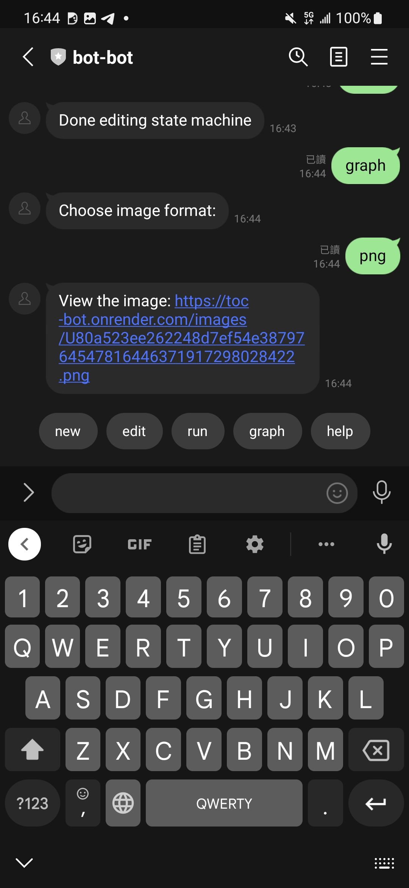
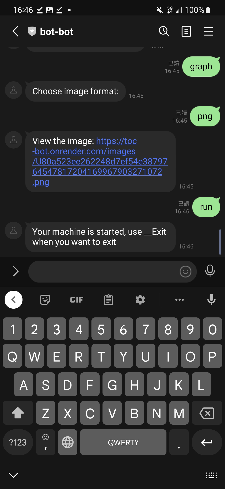

# Bot-bot: A simple bot creator
Create and run a simple line bot with bot-bot!

## FSM graph

## Features
You can:
- create a bot, backed by an FSM
- modify the bot you created
- run the bot in your chat room directly
- generate the graph of the FSM of your bot

All commands are provided via the bubbles at the bottom of the chat, to save our users from typing the same commands.

## Quickstart: A door
Let's use this bot to create a simple door that you can open/close.
Our goal FSM is:

### Add the bot

### Greeting
When you add (or unblock) the bot, you'll receive the greeting message along with the available actions: 

### New machine
Let's create our door with the `new` command. Click the bubble with `new`, it'll send the command automatically.

Send `opened` as the name of the initial state. Leave the rest to our bot. 

### Create another state
Clearly, we need another state `closed`. Create it with `state` command, it's showing just above the typing field.

Send `closed` to name the newly created state.

### Transitions
Now we have all our states, we can start creating transitions.

1. Use the command `transition` to create a transition.

2. We first specify the state the transition begins with. Let's create the `close` transition first. Send `opened`.

3. The `close` transition goes from `opened` to `closed` state. Send `closed` to indicate the destination of the transition.

4. Next, we specify the command received when the transition should happen. In this case, we use `close` as the trigger command.

5. Lastly, type any message you would like to send when the transition happens. We're going to send `The door is closed.`

The `close` transition is created!

Follow the steps to create the other transition `open`.
You may use any trigger command and message you like. In this demonstration, we use the command `open` and message `The door is opened.`

### Graph
Now you have created both needed states and transitions, let's check the graph of our FSM.
Use `done` command to go to previous menu.

Use `graph` command to generate the graph of your FSM.

Choose the format you like, we choose `png` here.

Visit the link and you can see the graph:

Hmm... it seems that we misconfigured the initial state.

### Change initial state
Let's change the initial state to `closed`.
Use `edit` command to show the editing menu (we've seen that before).

And use `change initial state` to change the initial state of our FSM.

Send the name of the desired initial state `closed`.

Now we've changed our initial state. You can check the graph correct with `done` and `graph`.

### Run the machine
Now your machine is ready!
Use `run` command to actually run the machine.

So now, when we send `open`:

And then `close`:

It worked!!

Use `__Exit` command at anytime you want to exit your own bot.

## Tooling
### Language
We use Kotlin in this project. Version above 1.6.20-M1 is needed, for experimental feature `context receiver`
Currently 1.7.21 is used.
### Web server
We use Ktor framework to create the server.
The server has 2 endpoints:
- `/`: handles line webhook
- `/images`: hosts generated user machines' images
### FSM tool
There is an FSM for each user served as the bot, with FSM graph shows above.
2 tools are used:
- [Tinder/StateMachine](https://github.com/Tinder/StateMachine): builds the FSM of the bot and users' machines
- [nidi3/graphviz-java](https://github.com/nidi3/graphviz-java): generates the graph of the machines from our internal representation
### Deployment
The server is deployed on [Render platform](https://render.com/) in a containerized fashion, with the assistance of [GitHub Action](https://github.com/features/actions).
The whole application (with its dependencies) is packed into a .jar file and executed inside a docker container.
